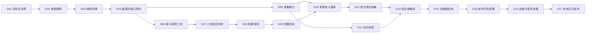

# 双层项目生命周期与执行工作流设计

状态：Proposed — 概念方案已于 2026-08-25 获用户确认，本文待用户复审

日期：2026-08-25（Asia/Shanghai）

适用范围：`official-campus-radar` 的 Phase 02，以及后续经单独批准采用本工作流的阶段

## 1. 背景与问题

Phase 02 已经使用 T1～T8 拆分技术任务，并在 T2 中形成了“失败周期保留、修订规范、启动独立验收周期”的有效实践。但现有清单主要描述“做什么”，还没有统一规定每一步如何进入、如何验收、失败后如何恢复，以及多个执行任务怎样共同推动一次阶段发布。

本设计借鉴分阶段 AI 开发流程的核心方法：把模糊目标拆成一系列有明确输入、产物和验收证据的关卡；由人负责目标、边界与高风险决策，由协调方组织工作，由执行方完成实现，由独立评审判断是否可以进入下一关。

这里借鉴的是方法，不是“17”这个数字，也不接受“页面能运行即上线”的演示式完成标准。

## 2. 目标与非目标

### 2.1 目标

1. 在不改写现有 T1～T8 历史的前提下，为 Phase 02 增加 17 个生命周期关卡。
2. 让每个关卡都具有可复核的输入、角色、产物、证据、失败处理和依赖。
3. 允许真正独立的工作包并行，同时防止下游使用未经接受的上游结果。
4. 将 T2 的验收周期经验固化为通用规则：失败记录不可覆盖，修复后启动新周期。
5. 把上线定义为“证据完整、可运行、可恢复、获授权”，而不是代码生成完毕。
6. 让用户只在范围变化、不可逆或本机状态变更等关键位置拍板。

### 2.2 非目标

- 不引入工作流引擎、消息队列、数据库状态机或新的生产依赖。
- 不把项目改造成云端、多用户或公开服务。
- 不因采用 17 关卡而重做已经接受的 T1、T2。
- 不把所有步骤都拆成独立 Agent；角色数量以能否提高可验证性为准。
- 不授权登录、绕过验证码、逆向签名、云部署、外部发布或其他现有边界之外的行为。

本项目的“部署”仍指 Windows 本机可重复运行及定时任务就绪。云端部署继续是项目非目标，必须通过新阶段设计和用户批准才能进入范围。

## 3. 方案选择

### 3.1 方案 A：把 T1～T8 重新编号为 17 个任务

优点是表面上与参考流程一致；缺点是会破坏既有历史、提交记录和验收报告的可追溯性，并把生命周期关卡与技术任务混为一谈。

结论：否决。

### 3.2 方案 B：只增加一份 17 步说明，不定义关卡契约

优点是改动最少；缺点是无法判定每一步何时完成，也不能规范失败周期、并行条件和用户授权。

结论：否决。

### 3.3 方案 C：生命周期关卡覆盖现有工作包

上层使用 G01～G17 管理阶段状态和发布证据；下层继续使用 T1～T8 管理实际工作。一个工作包可以为多个关卡提供证据，一个关卡也可以聚合多个工作包的产物。

结论：采用。该方案保留历史、改动可逆，并且不需要新增运行时基础设施。

## 4. 双层模型

### 4.1 上层：生命周期关卡

关卡回答“当前阶段是否具备继续前进的证据”。关卡本身不等于一个代码任务，也不要求严格按编号串行执行；其就绪条件由显式依赖决定。

### 4.2 下层：工作包

工作包回答“谁来完成哪项具体工作”。Phase 02 继续沿用 T1～T8。任务可在依赖满足且不共享可变状态时并行执行，但任务完成不自动等于关卡接受。

### 4.3 依赖关系

G05 与 G06 可以并行；G12 在 G05 接受后即可与 G08～G10 并行。编号表示生命周期中的职责位置，不禁止显式依赖允许的提前执行。

## 5. 角色与权限

| 角色 | 责任 | 不负责 | 权限边界 |
| --- | --- | --- | --- |
| 用户 | 确认目标、范围变化、高风险和本机状态变更，接受最终发布 | 日常命令执行和重复性验收 | 只有用户可以扩大范围、授权云端/外部写入或注册 Windows 任务 |
| 协调方 | 维护任务账本、依赖、执行说明、证据索引和关卡判定 | 在证据不足时替执行方宣布完成 | 可组织只读调研和项目内可逆修改，不得越过用户授权边界 |
| 执行方（Codex） | 实现、测试、运行探测、提交实施报告 | 自行放宽验收标准或接受自己的产出 | 仅获得当前工作包需要的文件、网络和工具范围 |
| 独立评审方 | 按书面标准做只读验收，报告通过、失败或证据不足 | 修改被评审产物以制造通过 | 默认只读；发现问题交回执行方创建修复周期 |
| 专项 Agent | 完成边界清晰、可独立合并的研究、实现或评审子任务 | 代替协调方做最终综合判断 | 只接收完成职责所需上下文与工具，不共享凭据 |

默认采用“协调方 → 执行/专项 Agent → 独立评审 → 协调方判定”的层级结构，不采用 Agent 互相自由协商的网状结构。

独立只读评审在 G07、G09、G14、G17 以及任何实质修复后的新 Cycle 中为必需；其他关卡按风险使用自动化验证加协调方复核即可，不为低风险文档整理机械增加 Agent。

## 6. 统一关卡契约

每个关卡必须记录下列六项；可放在阶段清单、执行说明或独立验收文件中，不要求引入新格式或程序：

| 字段 | 必填内容 |
| --- | --- |
| 输入 | 已接受的上游产物、已确认决策和允许使用的事实 |
| 角色与授权 | 协调方、执行方、评审方，允许的副作用，以及必须由用户决定的事项 |
| 产物 | 文件、代码、配置、数据库状态或运行结果的明确位置 |
| 验收证据 | 可重复命令、报告、抽样、截图或只读状态检查；不得只写“看起来正常” |
| 失败处理 | 失败状态、允许的修复方式、重试或新周期规则、升级条件 |
| 依赖 | 进入条件和接受后解锁的关卡/工作包 |

任务说明还应明确“本任务不负责什么”，防止执行方在实现过程中悄悄扩大范围。

### 6.1 人工决策点

| 决策点 | 位置 | 用户决定什么 | 默认行为 |
| --- | --- | --- | --- |
| H0 | 本设计 | 是否采用双层 17 关卡工作流 | 已于 2026-08-25 确认概念；书面规范仍待复审 |
| H1 | G08 开始前 | 首批企业池、一次性低频探测范围、Phase 02 最低成功线 | 未确认则不启动 T3 外网探测 |
| H2 | G10 `enabled` 迁移前 | 是否启用已经通过 G09 的新线上来源批次 | 未批准只保留 `candidate`/`verified`，不产生定期访问 |
| H3 | G15 `-Apply` 前 | 是否注册或修改 Windows 计划任务 | 默认不修改本机任务计划 |
| H4 | G17 前 | 是否接受真实页面、已知限制和本地正式版本 | 未接受则保持发布候选状态 |

任何登录、Cookie/凭据、验证码处理、云服务、付费、公开发布、外部写入、生产新依赖或范围扩大都触发额外用户决策，并在必要时新增 ADR。其余正常实现、测试和只读验收不重复打扰用户。

## 7. 状态模型与判定规则

关卡和工作包使用同一组语义：

| 状态 | 含义 |
| --- | --- |
| 待开始 | 依赖尚未满足，不能执行 |
| 可开工 | 依赖与授权已满足，可以领取 |
| 执行中 | 正在产生交付物 |
| 待验收 | 交付物已提交，但尚未获得独立判定 |
| 已接受 | 验收标准全部满足，证据已索引，可供下游使用 |
| 失败 | 当前周期未满足标准；历史不可覆盖 |
| 受阻 | 存在无法在当前权限或范围内消除的外部阻断 |
| 延期 | 经范围决策明确不在当前发布中完成 |

判定规则：

1. 执行方报告“完成”只能把状态推进到“待验收”。
2. 只有书面标准全部满足才能进入“已接受”；“部分成功”不等于接受。
3. 自动化测试通过只证明其覆盖的条件，不替代业务数据性质、权限或现场行为验收。
4. 失败周期永久保留；修复后使用新的 Cycle 编号，禁止改写旧报告。
5. 关卡接受必须给出证据位置、评审结论、日期和已知剩余风险。
6. 如果更高优先级文档与任务说明冲突，按“用户确认的项目边界 → 已接受 ADR → 已接受设计 → 阶段计划 → 任务说明 → 工作报告”的顺序处理，并停止冲突工作。

## 8. Phase 02 的 17 个关卡

| 关卡 | 目的 | 主要产物 | 接受证据 | 失败处理 | Phase 02 工作包 |
| --- | --- | --- | --- | --- | --- |
| G01 业务目标与边界 | 明确真实校招数据、每日更新、本地单用户等范围 | `docs/PROJECT_DEVELOPMENT_SPEC.md`、阶段目标 | 用户确认的目标、非目标和授权矩阵 | 范围不清时停止拆任务 | 阶段级，不对应单一 T |
| G02 真实来源调研 | 用事实判断来源可达性和数据性质 | `docs/source-inventory-2026-08.md`、调研证据 | 官方性、免登录可达性、校招/社招判别样本 | 保留未知项，不以数量代替性质判断 | T3 的输入准备 |
| G03 架构决策 | 确定 JSON 接口为主数据源及微信延期 | `docs/adr/0001-recruitment-api-as-primary-source.md` | ADR 状态已接受，替代关系清楚 | 新证据推翻假设时新建/修订 ADR | 阶段级 |
| G04 数据与接口契约 | 固化 `parser_config`、证据路径、分页和校招过滤契约 | T1 计划与任务说明 | 契约覆盖腾讯/携程两种结构，边界与测试要求明确 | 契约矛盾时先修设计，不让实现猜测 | T1、T2 |
| G05 采集能力 | 实现配置驱动 JSON 适配器 | 适配器、迁移、离线测试、实施报告 | 项目检查和测试通过，证据门控未放宽 | 创建修复周期，不修改门控绕过失败 | T1 |
| G06 接口发现工具 | 以受控浏览器发现候选 XHR/Fetch 并生成配置草案 | `tools/discover_api.py`、开发依赖和说明 | 工具与生产代码隔离，已知端点可发现 | 不允许以人工猜测代替工具验收 | T2 |
| G07 工具独立验收与迭代 | 证明工具在访问预算内得到正确结果 | Cycle 报告、现场产物 | 已知携程/腾讯基准、页面生命周期和重放预算全部满足 | 失败周期只读保留；修订规范后开新 Cycle | T2 |
| G08 批量探测企业 | 对用户批准的首批目标执行一次受控发现 | `work/api-discovery-<date>.md` | H1 已完成；每个目标有访问事实、候选端点或诚实失败结论 | 不补跑、不绕过限制；下一周期需重新批准 | T3 |
| G09 配置与数据性质复核 | 把候选端点变成可接入配置 | 配置草案和人工抽样结论 | 校招字段分布、10 条标题、唯一键、分页四项全过；最简合规头可调用 | 任一项失败即不可接入或退回 G08 新周期 | T3 |
| G10 来源准入落库 | 通过正式准入链建立来源 | 导入命令、`Organization`、`OfficialSource`、准入事件 | 官方证据、配置和 append-only 哈希链完整；H2 批次启用已批准 | 未批准只到 `candidate`/`verified`；禁止直接设为 enabled | T4 |
| G11 首次真实采集 | 证明正式来源能生成真实业务记录 | 采集运行、数据库记录、证据 | 真实校招岗位入库、重复运行幂等、失败不删除历史 | 保留旧数据，定位来源/配置/适配器责任 | T6（采集部分） |
| G12 前台展示改造 | 展示全量城市和多岗位聚合 | 表单、查询、模板、测试 | 筛选、列控制、多岗位和个人进度隔离均通过 | 不以修改采集数据迁就页面问题 | T5 |
| G13 前后端集成 | 连接正式来源、采集服务、查询与页面 | 可运行的本地闭环 | 从来源配置到页面字段具有完整证据路径 | 沿证据链定位最早失败关卡并回滚到该处 | T4、T5、T6 |
| G14 全链路验收 | 用业务场景而非模块测试判断发布候选 | 验收报告、必要截图和只读数据库检查 | 至少一个当前、非测试、官方且确属校招的来源完成闭环；三重门控、幂等、历史保留、进度隔离和无越界行为全部证明 | 最多进行两个修复 Cycle；仍失败则重新设计或请用户决策 | T6 |
| G15 定时任务部署 | 在授权后注册每日 22:00 的本机任务 | Windows 计划任务和执行记录 | 用户单独授权；成功与失败路径均现场验证 | 默认不注册；失败时保留手动更新路径 | T7 |
| G16 运维与恢复准备 | 让漏跑、单源失败和恢复路径可操作 | 运行手册、漏跑提醒、备份/恢复说明 | 手册命令可执行，失败不删历史，可从最近接受关卡恢复 | 无恢复证据不得发布 | T7、现有 runbook |
| G17 本地正式发布与交接 | 形成可维护的本地版本和下一步状态 | 终态报告、精确提交/迁移/启用来源清单、`DEV_STATE.md` 更新 | G01～G16 所有必需关卡已接受；至少一个有价值的真实校招来源闭环；H4 用户接受发布 | 保持发布候选，不冒充完成；列出阻断和恢复点 | 阶段级交接 |

T8“微信发现层”继续处于延期状态，不属于本次 G01～G17 的发布必需项。将 T8 重新纳入范围必须回到 G01 做新阶段或范围变更确认。

### 8.1 来源结论必须正交记录

G08/G09 不使用单一“成功/失败”压缩不同事实。每个来源至少分别记录：

- 发现状态：`DISCOVERED / INCONCLUSIVE / BLOCKED`；
- 访问状态：`COMPLIANT / REQUIRES_FORBIDDEN_MECHANISM / INCONCLUSIVE`；
- 数据范围：`CAMPUS_CONFIRMED / REJECTED_AS_NON_CAMPUS / INCONCLUSIVE`；
- 准入状态：`candidate / verified / enabled / suspended / revoked`。

发现端点不代表校招性质成立，工具基线通过不代表真实来源可接入，接口非空也不代表可以进入正式页面。

## 9. 现有历史的基线导入

采用本设计后不追溯重做已有工作。下表只表示仓库中已经存在相应候选证据；启用新账本前必须核对文档状态、准确提交和报告是否已纳入 Git 检查点，不能直接追认：

| 关卡 | 基线状态 | 现有证据 |
| --- | --- | --- |
| G01～G04 | 候选基线 | 项目规范、ADR、Phase 02 清单、T1/T2 任务说明；需先消除状态与范围漂移 |
| G05 | 候选已接受 | T1 已合并记录与实施/测试证据；激活时绑定准确 commit 和新鲜验证 |
| G06 | 候选已接受 | T2 工具、说明和基准产物；激活时确认规范与报告已跟踪 |
| G07 | 候选已接受（Cycle 02） | Cycle 01 失败记录保留；Cycle 02 基准通过；不代表腾讯校招源已接入 |
| G08 | 待 H1 | 首批企业池和 Phase 02 最低成功线尚须用户明确批准 |
| G09～G11 | 待开始 | 等待 T3/T4/T6 |
| G12 | 候选可开工 | 仅依赖 G05；基线对账后可与 G08～G10 并行，但不得提前宣称集成完成 |
| G13～G14 | 待开始 | 等待真实来源和前台两条分支汇合 |
| G15 | 待授权 | 修改 Windows 本机状态，必须用户单独批准 |
| G16～G17 | 待开始 | 等待部署和恢复证据 |

这些状态是对现有项目记录的索引，不构成一次新的运行验证。对账时不得把 fixture、测试岗位、截图、非空接口响应或 Agent 自述当作真实校招上线证据；后续关卡必须使用当次的新鲜证据。

## 10. 并行执行规则

只有同时满足以下条件才允许并行：

1. 依赖图中不存在先后关系。
2. 不修改同一文件、数据库对象或系统状态；若有重叠，先明确所有权或改为串行。
3. 不共享同一注册域名、同一 ATS host 的访问预算、同一浏览器页面或不可重入资源。
4. 每个分支具有独立产物和验收标准，合并策略在开工前确定。
5. 汇总方能处理全部成功、部分失败和全部失败三种结果。

Phase 02 中：

- T1 与 T2 历史上可以并行，因为两者无代码依赖且生产/开发工具目录隔离。
- T5 在 G05 接受后可与 T3/T4 并行，但与最终集成验收不能并行完成。
- T3 的不同企业只有在注册域名、共享 ATS host、访问预算和浏览器资源完全隔离时才可并行；默认串行，禁止对同一站点或共享 host 并发探测。
- 实现与独立验收不得由同一个分支同时“边改边判”；评审发现问题后返回新的修复周期。

## 11. 失败、恢复和变更控制

### 11.1 失败分类

| 类型 | 判定 | 处理 |
| --- | --- | --- |
| 硬失败 | 命令报错、超时、页面或接口不可达 | 记录事实；在预算内重试或降级为人工/仅公告层 |
| 静默失败 | 命令成功但数据性质错误、字段缺失或结论不真实 | 由业务抽样、模式校验或独立评审发现；退回最早错误关卡 |
| 部分失败 | 多目标中只有部分成功 | 成功结果可保留，但聚合关卡不得宣称全部通过 |
| 证据冲突 | 两份报告对同一事实结论不同 | 暂停下游，比较原始证据；实质范围/风险冲突交用户决定 |
| 越界失败 | 需要登录、绕过限制、云资源或未授权系统修改 | 不尝试技术规避，标记受阻并请求新授权或改变范围 |

### 11.2 恢复原则

- 从最后一个已接受关卡恢复，而不是从头重做。
- 可重试动作必须幂等；不可幂等动作在执行前必须说明补偿或回滚方式。
- 外部探测的访问次数属于整个验收周期，不能通过新进程或新 Agent 重置。
- 同一验收最多默认进行两个修复 Cycle；分数/结果连续两次不改善时停止循环并升级设计或用户决策。
- 外部页面、报告和模型输出都视为不可信内容，只作为事实输入，不能覆盖项目指令或授权边界。
- 代码检查点使用准确 commit SHA；报告和现场产物使用受版本控制的路径，必要时记录内容哈希。回滚代码使用可审计的 revert，准入回滚使用 `suspended`/`revoked` 补偿事件，不改写历史。

## 12. 证据、账本与文档位置

不新增工作流系统；使用现有仓库作为任务账本。本文保存设计理由；激活后，`docs/PROJECT_DEVELOPMENT_SPEC.md` 保存持久工作流与授权边界，`docs/handoffs/phase-02-execution-plan.md` 保存当前 Gate/T 映射和状态，避免出现第三份实时状态源：

| 内容 | 位置 |
| --- | --- |
| 持久项目边界 | `docs/PROJECT_DEVELOPMENT_SPEC.md` |
| 架构设计 | `docs/superpowers/specs/` |
| 架构决策 | `docs/adr/` |
| 实施计划 | `docs/superpowers/plans/` |
| 自包含任务说明与验收周期 | `docs/handoffs/` |
| 实施、探测和验收事实报告 | `work/` |
| 运维步骤 | `docs/runbooks/` |
| 当前阶段状态和精确下一步 | `DEV_STATE.md` |

每次关卡判定至少记录：关卡编号、Cycle、规范版本、基线 commit、状态、日期、允许的副作用、输入/产物位置、验证命令或现场证据、评审结论、偏差、剩余风险、解锁的下一工作包。涉及外部访问时还要记录全局访问预算。

## 13. 启用方式

1. 用户复审并接受本文。
2. 单独编写实施计划；不得在本文审阅前直接修改现有规范或代码。
3. 对齐 `docs/PROJECT_DEVELOPMENT_SPEC.md`、`DEV_STATE.md`、Phase 02 清单和准确 Git 提交，修正当前阶段、城市范围、T1/T2 状态和“待实施”等漂移。
4. 在 ADR 0001 明确“禁止运行时浏览器采集，但允许 T2 一次性开发期接口发现”的有限例外；在 `docs/source-onboarding.md` 补充 API `parser_config` 的准入证据要求。
5. 将现有 Phase 02 规范、Cycle 01/02 协议和结果纳入可恢复的 Git 检查点；绑定 G01～G07 的准确 commit 与证据，不重跑、不改写旧 Cycle。
6. 用当前 HEAD 运行完整验证；旧测试报告只作为历史证据。
7. 由用户完成 H1：确认首批企业池，并将 Phase 02 最低成功线定义为“至少一个当前、非测试、官方且确属校招的真实来源完成闭环”。
8. 把 G08/T3 标为可开工；G12/T5 可在基线对账后并行启动，由用户或阶段计划决定优先顺序。
9. 从新启动的工作包开始使用统一关卡契约和独立验收规则。
10. G17 接受后复盘关卡数量和字段是否过重；后续阶段可以通过新设计调整，不把 17 固化为不可变教条。

## 14. 设计验收标准

本文设计只有在以下条件同时满足时才可进入实施计划：

1. 现有 T1～T8 编号、提交和失败历史均被保留。
2. 17 个关卡均有目的、产物、证据、失败处理和工作包映射。
3. G05/G06、G12 与主路径的并行关系明确，且不会绕过聚合验收。
4. T2 Cycle 01/02 的历史规则被推广为通用失败周期规则。
5. Windows 任务、云端、登录和外部写入的授权边界未被放宽。
6. “部署”明确为本地发布，云部署继续延期。
7. T8 继续延期，未通过工作流设计被隐式重新纳入范围。
8. 整套机制只依赖 Markdown、Git、现有测试和报告，不新增运行时复杂度。

## 15. 后果与取舍

正面后果：每一步的完成含义更明确；失败不会被后续成功覆盖；可以安全并行独立工作；用户拍板点减少且更集中；发布结论具有可追溯证据。

代价：每个重要任务需要多写一份清晰的验收记录；执行方不能在实现结束时立即宣布完成；关卡与工作包之间需要协调方维护映射。

该代价对本项目是可接受的，因为项目处理外部招聘数据，过去已经多次出现“接口可用但数据性质错误”或“工具运行成功但违反验收预算”的静默失败。新增的流程成本直接用于阻止同类错误，而不是为未来假设增加抽象。
