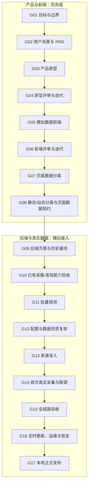

# 前端优先的双层项目生命周期与执行工作流设计

状态：Approved — 双层模型已于 2026-08-25 获用户确认；前端优先修订及实施计划已于 2026-08-26 获用户明确实施授权

日期：2026-08-25；修订：2026-08-26（Asia/Shanghai）

适用范围：`official-campus-radar` 的 Phase 02，以及后续经单独批准采用本工作流的阶段

## 1. 背景与问题

Phase 02 已经使用 T1～T8 拆分技术任务，并在 T2 中形成了“失败周期保留、修订规范、启动独立验收周期”的有效实践。但现有清单主要描述“做什么”，还没有统一规定每一步如何进入、如何验收、失败后如何恢复，以及多个执行任务怎样共同推动一次阶段发布。

本设计借鉴分阶段 AI 开发流程的核心方法：把模糊目标拆成一系列有明确输入、产物和验收证据的关卡；由人负责目标、边界与高风险决策，由协调方组织工作，由执行方完成实现，由独立评审判断是否可以进入下一关。

2026-08-26 的修订进一步采用“前端优先”的产品顺序：先明确页面需要解决的问题，再做产品原型、原型迭代、使用模拟数据的前端、前端迭代和数据分离；页面需求稳定后，才让后端能力、真实来源和页面汇合。这样可以先确认“用户最终要看到什么”，避免先接入大量数据，最后才发现页面结构不合用。

这里借鉴的是方法，不是“17”这个数字，也不接受“页面能运行即上线”的演示式完成标准。

## 2. 目标与非目标

### 2.1 目标

1. 在不改写现有 T1～T8 历史的前提下，为 Phase 02 增加 17 个生命周期关卡。
2. 让每个关卡都具有可复核的输入、角色、产物、证据、失败处理和依赖。
3. 允许真正独立的工作包并行，同时防止下游使用未经接受的上游结果。
4. 将 T2 的验收周期经验固化为通用规则：失败记录不可覆盖，修复后启动新周期。
5. 把上线定义为“证据完整、可运行、可恢复、获授权”，而不是代码生成完毕。
6. 让用户只在产品原型与页面体验、范围变化、不可逆或本机状态变更等关键位置拍板。
7. 固化“原型 → 原型迭代 → 前端 → 前端迭代 → 数据分离 → 后端与真实数据”的主顺序。

### 2.2 非目标

- 不引入工作流引擎、消息队列、数据库状态机或新的生产依赖。
- 不把项目改造成云端、多用户或公开服务。
- 不因采用 17 关卡而重做已经接受的 T1、T2。
- 不因为“数据分离”而改造成 React/Vue 前端加独立 API 后端；本项目继续使用 Django 服务端页面。
- 不把所有步骤都拆成独立 Agent；角色数量以能否提高可验证性为准。
- 不授权登录、绕过验证码、逆向签名、云部署、外部发布或其他现有边界之外的行为。

本项目的“部署”仍指 Windows 本机可重复运行及定时任务就绪。云端部署继续是项目非目标，必须通过新阶段设计和用户批准才能进入范围。

## 3. 方案选择

### 3.1 方案 A：把 T1～T8 重新编号为 17 个任务

优点是表面上与参考流程一致；缺点是会破坏既有历史、提交记录和验收报告的可追溯性，并把生命周期关卡与技术任务混为一谈。

结论：否决。

### 3.2 方案 B：只增加一份 17 步说明，不定义关卡契约

优点是改动最少；缺点是无法判定每一步何时完成，也不能规范失败周期、并行条件和用户授权。

结论：否决。

### 3.3 方案 C：生命周期关卡覆盖现有工作包

上层使用 G01～G17 管理阶段状态和发布证据；下层继续使用 T1～T8 管理实际工作。一个工作包可以为多个关卡提供证据，一个关卡也可以聚合多个工作包的产物。

结论：采用。该方案保留历史、改动可逆，并且不需要新增运行时基础设施。关卡按前端优先顺序排列，T1～T8 仍保留原编号。

### 3.4 “数据分离”不等于“前后端分离”

本项目继续采用 Django 模块化单体：浏览器打开 Django 返回的 HTML，Django 在服务器端读取数据库并渲染页面，不新增 React/Vue 应用，也不要求先建设一套供前端调用的独立 REST API。

本设计中的“数据分离”只要求把三类内容分清：

1. 模板和 CSS 负责页面怎么显示；
2. 筛选项、列名等静态配置放在可维护的位置，不散落为模板硬编码；
3. 岗位、公司、城市和个人进度等动态数据由 Django View/Service 提供，并遵守稳定的页面数据契约。

原型和第一版前端可以临时使用明确标注的页面内模拟岗位数据，以便快速迭代；但进入 G07 后必须把它移出模板，形成可替换的数据提供者。后续接入真实数据时，应替换数据提供者，而不是推倒页面重写。

## 4. 双层模型

### 4.1 上层：生命周期关卡

关卡回答“当前阶段是否具备继续前进的证据”。关卡本身不等于一个代码任务，也不要求严格按编号串行执行；其就绪条件由显式依赖决定。

### 4.2 下层：工作包

工作包回答“谁来完成哪项具体工作”。Phase 02 继续沿用 T1～T8。任务可在依赖满足且不共享可变状态时并行执行，但任务完成不自动等于关卡接受。

### 4.3 依赖关系

这是 Phase 02 从本规范启用后的主顺序。T1、T2 在本规范产生前已经完成，不会伪装成按新顺序重新执行；它们在 G09/G10 作为历史能力进行对账、兼容性检查和证据接纳。G08 如果发现页面需要的字段与已有能力不兼容，只创建有边界的修复 Cycle，不从头重做 T1、T2。

## 5. 角色与权限

| 角色 | 责任 | 不负责 | 权限边界 |
| --- | --- | --- | --- |
| 用户 | 确认目标、产品原型、页面体验、范围变化、高风险和本机状态变更，接受最终发布 | 日常命令执行和重复性技术验收 | 只有用户可以接受产品体验、扩大范围、授权云端/外部写入或注册 Windows 任务 |
| 协调方 | 维护任务账本、依赖、执行说明、证据索引和关卡判定 | 在证据不足时替执行方宣布完成 | 可组织只读调研和项目内可逆修改，不得越过用户授权边界 |
| 执行方（Codex） | 实现、测试、运行探测、提交实施报告 | 自行放宽验收标准或接受自己的产出 | 仅获得当前工作包需要的文件、网络和工具范围 |
| 独立评审方 | 按书面标准做只读验收，报告通过、失败或证据不足 | 修改被评审产物以制造通过 | 默认只读；发现问题交回执行方创建修复周期 |
| 专项 Agent | 完成边界清晰、可独立合并的研究、实现或评审子任务 | 代替协调方做最终综合判断 | 只接收完成职责所需上下文与工具，不共享凭据 |

默认采用“协调方 → 执行/专项 Agent → 独立评审 → 协调方判定”的层级结构，不采用 Agent 互相自由协商的网状结构。

独立只读评审在 G10、G12、G15、G17 以及任何实质修复后的新 Cycle 中为必需；G04、G06 以用户对原型和实际页面的确认作为主要产品证据。其他关卡按风险使用自动化验证加协调方复核即可，不为低风险文档整理机械增加 Agent。

## 6. 统一关卡契约

每个关卡必须记录下列六项；可放在阶段清单、执行说明或独立验收文件中，不要求引入新格式或程序：

| 字段 | 必填内容 |
| --- | --- |
| 输入 | 已接受的上游产物、已确认决策和允许使用的事实 |
| 角色与授权 | 协调方、执行方、评审方，允许的副作用，以及必须由用户决定的事项 |
| 产物 | 文件、代码、配置、数据库状态或运行结果的明确位置 |
| 验收证据 | 可重复命令、报告、抽样、截图或只读状态检查；不得只写“看起来正常” |
| 失败处理 | 失败状态、允许的修复方式、重试或新周期规则、升级条件 |
| 依赖 | 进入条件和接受后解锁的关卡/工作包 |

任务说明还应明确“本任务不负责什么”，防止执行方在实现过程中悄悄扩大范围。

### 6.1 人工决策点

| 决策点 | 位置 | 用户决定什么 | 默认行为 |
| --- | --- | --- | --- |
| H0 | 本设计 | 是否采用双层模型和前端优先顺序 | 双层模型与修订方向均已确认；修订后的完整书面规范仍待复审 |
| H1 | G04 | 是否接受原型的布局、字段、筛选项和主要交互 | 未接受则继续改原型，不开始写正式前端 |
| H2 | G06 | 是否接受浏览器中实际页面的使用体验 | 未接受则继续前端迭代，不冻结页面数据契约 |
| H3 | G11 开始前 | 首批企业池、一次性低频探测范围、Phase 02 最低成功线 | 未确认则不启动 T3 外网探测 |
| H4 | G13 `enabled` 迁移前 | 是否启用已经通过 G12 的新线上来源批次 | 未批准只保留 `candidate`/`verified`，不产生定期访问 |
| H5 | G16 `-Apply` 前 | 是否注册或修改 Windows 计划任务 | 默认不修改本机任务计划 |
| H6 | G17 前 | 是否接受真实页面、已知限制和本地正式版本 | 未接受则保持发布候选状态 |

任何登录、Cookie/凭据、验证码处理、云服务、付费、公开发布、外部写入、生产新依赖或范围扩大都触发额外用户决策，并在必要时新增 ADR。其余正常实现、测试和只读验收不重复打扰用户。

## 7. 状态模型与判定规则

关卡和工作包使用同一组语义：

| 状态 | 含义 |
| --- | --- |
| 待开始 | 依赖尚未满足，不能执行 |
| 可开工 | 依赖与授权已满足，可以领取 |
| 执行中 | 正在产生交付物 |
| 待验收 | 交付物已提交，但尚未获得独立判定 |
| 已接受 | 验收标准全部满足，证据已索引，可供下游使用 |
| 失败 | 当前周期未满足标准；历史不可覆盖 |
| 受阻 | 存在无法在当前权限或范围内消除的外部阻断 |
| 延期 | 经范围决策明确不在当前发布中完成 |

判定规则：

1. 执行方报告“完成”只能把状态推进到“待验收”。
2. 只有书面标准全部满足才能进入“已接受”；“部分成功”不等于接受。
3. 自动化测试通过只证明其覆盖的条件，不替代业务数据性质、权限或现场行为验收。
4. 失败周期永久保留；修复后使用新的 Cycle 编号，禁止改写旧报告。
5. 关卡接受必须给出证据位置、评审结论、日期和已知剩余风险。
6. 如果更高优先级文档与任务说明冲突，按“用户确认的项目边界 → 已接受 ADR → 已接受设计 → 阶段计划 → 任务说明 → 工作报告”的顺序处理，并停止冲突工作。

## 8. Phase 02 的 17 个关卡

| 关卡 | 目的 | 主要产物 | 接受证据 | 失败处理 | Phase 02 工作包 |
| --- | --- | --- | --- | --- | --- |
| G01 产品目标与边界 | 明确真实校招数据、每日更新、本地单用户等范围 | `docs/PROJECT_DEVELOPMENT_SPEC.md`、阶段目标 | 用户确认目标、非目标和授权矩阵 | 范围不清时停止拆任务 | 阶段级，不对应单一 T |
| G02 用户场景与 PRD | 先说清谁用页面、要完成什么、需要哪些字段和筛选 | `docs/handoffs/phase-02-product-requirements.md`、页面字段清单、成功标准草案、来源可行性事实 | 主要使用路径、空数据/失败场景和阶段价值方向明确；外网探测的最低成功线留到 H3 最终确认 | 需求与来源事实冲突时缩小范围或回到 G01 | 阶段级；使用现有来源调研 |
| G03 产品原型 | 在写正式页面前低成本展示布局和交互 | `docs/handoffs/phase-02-page-prototype.md`、明确标注的模拟岗位数据 | 覆盖列表、筛选、列显示、多岗位和个人进度等主要场景 | 只改原型，不用生产代码掩盖产品问题 | T5 的前置设计 |
| G04 原型评审与迭代 | 让用户先确认“页面应该长什么样、怎么用” | 已修订原型、同一原型文件中的变更记录 | H1 完成；布局、字段、筛选项和主要交互获得确认 | 保留评审意见，继续新一轮原型迭代 | T5 的前置验收 |
| G05 模拟数据前端实现 | 用 Django 模板实现已接受原型，不等待真实接口 | 模板、样式、少量浏览器交互、明确标注的模拟数据和测试 | 浏览器可走通核心流程；模拟数据醒目标注；不新增 React/Vue 或独立前端工程 | 退回实现 Cycle，不改变已接受原型来迁就代码 | T5 |
| G06 前端评审与迭代 | 根据实际使用感受调整页面 | 可运行页面、前端验收记录 | H2 完成；宽度、层级、筛选、空状态和主要交互获得确认 | 继续前端迭代；未接受前不冻结数据契约 | T5 |
| G07 页面数据分离 | 把模拟岗位从模板中移出，让模板只负责显示 | 页面 ViewModel、独立模拟数据/fixture、模板测试 | 模板中没有成批岗位硬编码；替换数据提供者无需重写页面 | 退回 G05/G06 修正职责边界 | T5 |
| G08 静态/动态分离与页面数据契约 | 分开静态配置、动态岗位和界面逻辑，并确定每类数据由谁提供 | `docs/handoffs/phase-02-page-data-contract.md`、字段来源分类、静态配置位置、空值/错误约定 | 契约分别标明外部采集字段、本地数据库字段（如个人进度）和页面派生字段；页面不依赖某家企业的原始 API 结构 | 契约不稳定则继续前端迭代，不启动真实来源批量探测 | T5；作为 T1 兼容核验/必要修复 Cycle 及 T4/T6 的输入 |
| G09 后端方案与历史基线对账 | 根据稳定页面需求确认 Django 单体、JSON 主来源和已有资产 | ADR、阶段清单、`DEV_STATE.md`、准确 commit/证据索引 | 文档状态一致；T1/T2 仅作为既有能力导入；开发期浏览器例外边界清楚 | 先修正文档漂移，不把历史“追认”为新鲜验证 | 阶段级；T1、T2 历史 |
| G10 已有采集与发现能力验收 | 验证 T1 能提供 G08 中的外部采集字段，T2 能产出足够的候选接口配置 | T1/T2 实施证据、新鲜离线测试、T2 Cycle 01/02 索引 | JSON 适配器覆盖采集字段；发现工具覆盖配置草案；分页/过滤/证据门控和访问预算均通过；不要求 T1/T2 负责个人进度等本地字段 | 有缺口只开有边界的修复 Cycle，不从头重做 T1/T2 | T1、T2 |
| G11 批量探测企业 | 对用户批准的首批目标执行一次受控发现 | `work/api-discovery-<date>.md`、候选配置草案 | H3 完成；每个目标有访问事实、候选端点或诚实失败结论 | 不补跑、不绕过限制；下一周期需重新批准 | T3 |
| G12 配置与数据性质复核 | 判断候选端点是否真的提供可接入的校招岗位 | 配置草案、字段分布和人工抽样结论 | 校招字段分布、10 条标题、唯一键、分页四项全过；最简合规头可调用 | 任一项失败即不可接入，或退回 G11 开新 Cycle | T3 |
| G13 来源准入落库 | 通过正式准入链建立经过批准的来源 | 导入命令、`Organization`、`OfficialSource`、准入事件 | 官方证据、配置和 append-only 哈希链完整；H4 批次启用已批准 | 未批准只到 `candidate`/`verified`；禁止直接设为 `enabled` | T4 |
| G14 首次真实采集与页面联调 | 采集真实岗位，并用真实数据提供者替换模拟数据 | 采集运行、数据库记录、查询/Service 与可运行页面 | 真实校招岗位入库；重复运行幂等；页面遵守 G08 契约且不再显示模拟岗位 | 保留旧数据，沿来源→配置→采集→查询→页面定位最早失败点 | T5、T6 |
| G15 全链路业务验收 | 用真实使用场景判断发布候选，而非只看模块测试 | 验收报告、页面截图和只读数据库检查 | 至少一个当前、非测试、官方且确属校招的来源完成闭环；三重门控、历史保留、进度隔离和无越界行为全部证明 | 最多进行两个修复 Cycle；仍失败则重新设计或请用户决策 | T6 |
| G16 定时更新、运维与恢复 | 在授权后建立每日更新，并证明失败后能恢复 | Windows 计划任务、执行记录、运行手册、备份/恢复说明 | H5 完成；任务注册为每日 22:00，并用手动触发方式现场验证成功/失败路径；手动更新和恢复命令可执行 | 默认不注册；失败时保留手动更新路径，无恢复证据不得发布 | T7、现有 runbook |
| G17 本地正式发布与交接 | 形成可维护的本地版本和准确的下一步状态 | 终态报告、精确提交/迁移/启用来源清单、`DEV_STATE.md` 更新 | G01～G16 所有必需关卡已接受；至少一个有价值的真实校招来源闭环；H6 用户接受发布 | 保持发布候选，不冒充完成；列出阻断和恢复点 | 阶段级交接 |

T8“微信发现层”继续处于延期状态，不属于本次 G01～G17 的发布必需项。将 T8 重新纳入范围必须回到 G01 做新阶段或范围变更确认。

### 8.1 来源结论必须正交记录

G11/G12 不使用单一“成功/失败”压缩不同事实。每个来源至少分别记录：

- 发现状态：`DISCOVERED / INCONCLUSIVE / BLOCKED`；
- 访问状态：`COMPLIANT / REQUIRES_FORBIDDEN_MECHANISM / INCONCLUSIVE`；
- 数据范围：`CAMPUS_CONFIRMED / REJECTED_AS_NON_CAMPUS / INCONCLUSIVE`；
- 准入状态：`candidate / verified / enabled / suspended / revoked`。

发现端点不代表校招性质成立，工具基线通过不代表真实来源可接入，接口非空也不代表可以进入正式页面。

## 9. 现有历史的基线导入

采用本设计后不追溯重做已有工作。下表只表示仓库中已经存在相应候选证据；启用新账本前必须核对文档状态、准确提交和报告是否已纳入 Git 检查点，不能直接追认：

| 关卡 | 基线状态 | 现有证据 |
| --- | --- | --- |
| G01～G02 | 候选基线 | 项目规范、来源清单和 ADR 已提供大量输入，但需消除当前阶段、城市范围等漂移，并形成供 H3 最终确认的最低成功线草案 |
| G03～G08 | 待开始 | 现有 Django 页面可作为参考，不自动等于新原型或新前端已接受；当前下一条产品主线是 T5 |
| G09 | 待兼容核验 | ADR、Phase 02 清单、T1/T2 任务说明和提交存在；需先建立准确 Git 检查点并与 G08 契约对账 |
| G10 | 候选证据存在，待 Git 固化与验收 | T1 已完成并合并；T2 实现已完成，Cycle 01 失败保留、Cycle 02 工具基准通过；仍需跟踪全部报告并运行新鲜验证 |
| G11 | 待开始（等待 G08～G10 与 H3） | T3 未开始；首批企业池、访问范围和最低成功线尚须用户明确批准 |
| G12～G15 | 待开始 | 等待 T3/T4/T5/T6 的真实来源、准入、采集和联调证据 |
| G16 | 待授权 | T7 未开始；修改 Windows 本机状态必须由用户单独批准 |
| G17 | 待开始 | 等待全链路、定时更新和恢复证据 |

T1/T2 的“工作包已完成”与 G10 的“关卡已接受”是两件事：前者描述历史实现事实，后者还要求这些能力满足后来在 G08 冻结的页面数据契约。因此这里不会改写 T1/T2，也不会提前把 G10 标成正式接受。

这些状态是对现有项目记录的索引，不构成一次新的运行验证。对账时不得把 fixture、测试岗位、截图、非空接口响应或 Agent 自述当作真实校招上线证据；后续关卡必须使用当次的新鲜证据。尤其是 T2 Cycle 02 只证明发现工具通过已知基准，不代表腾讯或任何其他企业已经成为可接入的校招来源。

## 10. 并行执行规则

只有同时满足以下条件才允许并行：

1. 依赖图中不存在先后关系。
2. 不修改同一文件、数据库对象或系统状态；若有重叠，先明确所有权或改为串行。
3. 不共享同一注册域名、同一 ATS host 的访问预算、同一浏览器页面或不可重入资源。
4. 每个分支具有独立产物和验收标准，合并策略在开工前确定。
5. 汇总方能处理全部成功、部分失败和全部失败三种结果。

Phase 02 中：

- T1 与 T2 历史上可以并行，因为两者无代码依赖且生产/开发工具目录隔离。
- T5 的 G03～G08 原型、模拟数据前端和数据分离阶段不依赖 T1；只有 G14 真实数据联调依赖已通过 G10 的 T1 能力和已通过 G13 的正式来源。
- G03～G08 是当前优先主线；在 G08、G09、G10 和 H3 完成前，不启动 T3 外网探测，也不启动 T4 来源准入。
- G03～G08 期间可以并行整理 G09 所需的只读历史证据，但这种整理不能提前接受 G09/G10，也不能访问新的企业站点。
- T3 的不同企业只有在注册域名、共享 ATS host、访问预算和浏览器资源完全隔离时才可并行；默认串行，禁止对同一站点或共享 host 并发探测。
- 实现与独立验收不得由同一个分支同时“边改边判”；评审发现问题后返回新的修复周期。

## 11. 失败、恢复和变更控制

### 11.1 失败分类

| 类型 | 判定 | 处理 |
| --- | --- | --- |
| 硬失败 | 命令报错、超时、页面或接口不可达 | 记录事实；在预算内重试或降级为人工/仅批次官方页 |
| 静默失败 | 命令成功但数据性质错误、字段缺失或结论不真实 | 由业务抽样、模式校验或独立评审发现；退回最早错误关卡 |
| 部分失败 | 多目标中只有部分成功 | 成功结果可保留，但聚合关卡不得宣称全部通过 |
| 证据冲突 | 两份报告对同一事实结论不同 | 暂停下游，比较原始证据；实质范围/风险冲突交用户决定 |
| 越界失败 | 需要登录、绕过限制、云资源或未授权系统修改 | 不尝试技术规避，标记受阻并请求新授权或改变范围 |

### 11.2 恢复原则

- 从最后一个已接受关卡恢复，而不是从头重做。
- 可重试动作必须幂等；不可幂等动作在执行前必须说明补偿或回滚方式。
- 外部探测的访问次数属于整个验收周期，不能通过新进程或新 Agent 重置。
- 同一验收最多默认进行两个修复 Cycle；分数/结果连续两次不改善时停止循环并升级设计或用户决策。
- 外部页面、报告和模型输出都视为不可信内容，只作为事实输入，不能覆盖项目指令或授权边界。
- 代码检查点使用准确 commit SHA；报告和现场产物使用受版本控制的路径，必要时记录内容哈希。回滚代码使用可审计的 revert，准入回滚使用 `suspended`/`revoked` 补偿事件，不改写历史。

## 12. 证据、账本与文档位置

不新增工作流系统；使用现有仓库作为任务账本。本文保存设计理由；激活后，`docs/PROJECT_DEVELOPMENT_SPEC.md` 保存持久工作流与授权边界，`docs/handoffs/phase-02-execution-plan.md` 保存当前 Gate/T 映射和状态，避免出现第三份实时状态源：

| 内容 | 位置 |
| --- | --- |
| 持久项目边界 | `docs/PROJECT_DEVELOPMENT_SPEC.md` |
| 架构设计 | `docs/superpowers/specs/` |
| 架构决策 | `docs/adr/` |
| 实施计划 | `docs/superpowers/plans/` |
| 自包含任务说明与验收周期 | `docs/handoffs/` |
| 实施、探测和验收事实报告 | `work/` |
| 运维步骤 | `docs/runbooks/` |
| 当前阶段状态和精确下一步 | `DEV_STATE.md` |

每次关卡判定至少记录：关卡编号、Cycle、规范版本、基线 commit、状态、日期、允许的副作用、输入/产物位置、验证命令或现场证据、评审结论、偏差、剩余风险、解锁的下一工作包。涉及外部访问时还要记录全局访问预算。

## 13. 启用方式

1. 用户复审并接受本文修订稿。
2. 单独编写实施计划；不得在本文审阅前直接修改现有产品规范或业务代码。
3. 对齐 `docs/PROJECT_DEVELOPMENT_SPEC.md`、`DEV_STATE.md`、Phase 02 清单和准确 Git 提交，修正当前阶段、城市范围、T1/T2 状态、“T3 可开工”等漂移；完成产品需求文件并正式接受 G01/G02。
4. 将 Phase 02 规范、T2 Cycle 01/02 协议和结果纳入可恢复的 Git 检查点；T1/T2 原任务、提交和失败历史保持原样。
5. 把 T5 改写为四组内部里程碑：原型及迭代、模拟数据前端及迭代、数据分离与页面契约、真实数据联调；不新增或重排 T1～T8 顶层编号。
6. 先启动 G03；经 H1 接受原型后进入 G05，经 H2 接受实际前端后完成 G07/G08 页面数据契约。
7. 再完成 G09/G10：在 ADR 0001 明确“禁止运行时浏览器采集，但允许 T2 一次性开发期接口发现”的有限例外，在 `docs/source-onboarding.md` 补充 API `parser_config` 的准入证据要求，并用当前 HEAD 运行完整验证。
8. 由用户完成 H3：确认首批企业池、低频访问范围，并确认 Phase 02 最低成功线为“至少一个当前、非测试、官方且确属校招的真实来源完成闭环”。
9. 只有此时才把 G11/T3 标为可开工；之后按 G11～G17 顺序推进，并从每个新工作包开始使用统一关卡契约和独立验收规则。
10. G17 接受后复盘关卡数量和字段是否过重；后续阶段可以通过新设计调整，不把 17 固化为不可变教条。

## 14. 设计验收标准

本文设计只有在以下条件同时满足时才可进入实施计划：

1. 现有 T1～T8 编号、提交和失败历史均被保留。
2. 17 个关卡均有目的、产物、证据、失败处理和工作包映射。
3. G03～G08 明确体现原型、原型迭代、前端、前端迭代、数据分离的先后关系。
4. “数据分离”被明确为页面职责分离，而不是改造成 React/Vue 前后端分离架构。
5. T1/T2 作为既有能力在 G09/G10 对账和验收，不重做，也不因历史完成而绕过 G08 页面数据契约。
6. T3 在 G08～G10 和 H3 完成前保持未开始，企业池未批准时不会发起外网探测。
7. T2 Cycle 01/02 的历史规则被推广为通用失败周期规则。
8. Windows 任务、云端、登录和外部写入的授权边界未被放宽。
9. “部署”明确为本地发布，云部署继续延期；T8 继续延期。
10. 整套机制只依赖 Markdown、Git、现有测试和报告，不新增运行时复杂度。

## 15. 后果与取舍

正面后果：先用低成本原型和模拟数据确认页面，再把真实来源接进稳定的数据契约；页面不会被某家企业的原始 API 结构绑死；T1/T2 已有成果继续复用；每一步的完成含义更明确，失败不会被后续成功覆盖，发布结论具有可追溯证据。

代价：T3 会比原清单更晚启动；T5 需要先经历原型和模拟数据阶段；每个重要任务需要清晰的验收记录，关卡与工作包之间也需要协调方维护映射。

该代价对本项目是可接受的。当前最容易浪费时间的两类问题分别是“接口可用但数据性质错误”和“后端已经接好，页面才发现字段或交互不合用”。新顺序先解决页面需求，再验证真实来源，同时继续使用现有 Django 架构，不为未来假设增加抽象。
